```
Course project of CSE463 Machine Learning, UNIST
```

## Task

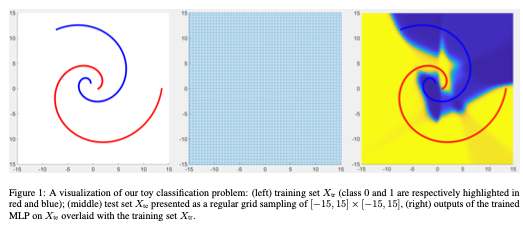

Our task is to train an MLP on$X_{tr}$, apply the trained MLP to the test set $X_{te}$, and visualize the corresponding test results. Our data are visualized in Fig. 1: The training set consists of 630 pairs of inputs and the corresponding ground-truth outputs: In Fig. 1(left), the location of each dot represents the corresponding training input $(x_1, x_2)$-coordinate values) while the class labels are highlighted by color. The accompanying `Trn.txt` file contains this training set: For each line, the first two columns represent an input $x = [x_1,x_2]^⊤$ and the third column provides the corresponding class label (0 or 1). The test set consists of 10,200 data instances and they are provided in `Tst.txt` file where two columns represent a test input per line.

 ## Implement Detail

### My MLP Architecture

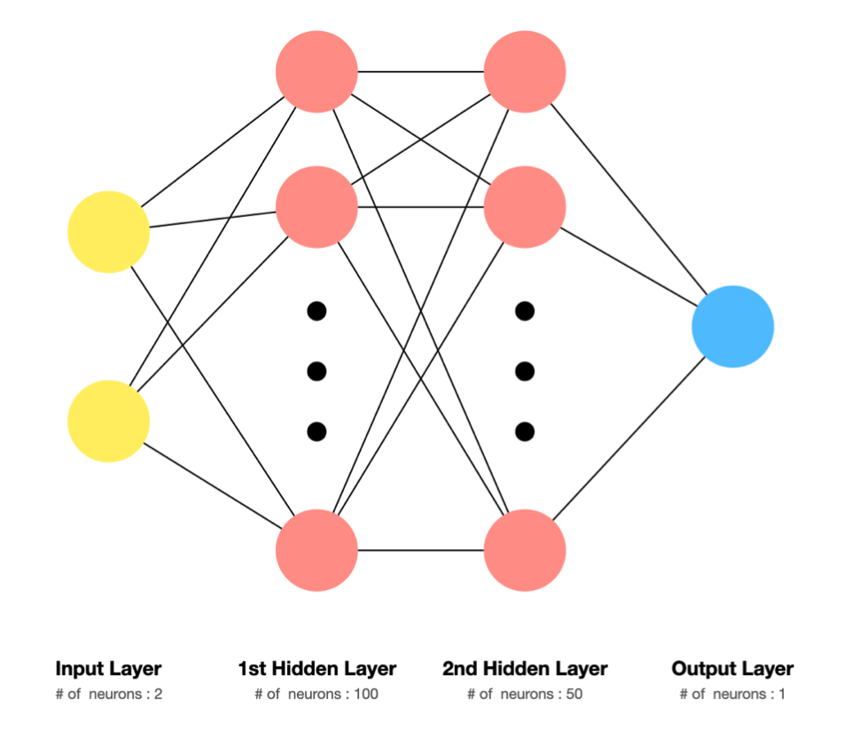

### Weight Initialization

- Using `Xavier Normal Initialization` for weight initialization 

  Xavier Normal Initialization[[Glorot & Bengio, AISTATS 2010](http://jmlr.org/proceedings/papers/v9/glorot10a/glorot10a.pdf)]

$$
W \sim N(0,Var(W))\\
Var(W) = \sqrt{2 \over {n_{in}+n_{out}}}
$$

​	 ($n_{in}$ : # of previous layer's neurons, $n_{out}$ : # of next layer's neurons)

- Bias initialization as **zero**

### Hyper-Parameter Setting

- `Learning Rate` : 1
- `epochs` : 50
- `batch size` : 1 (fully-SGD)
- using sigmoid  for activation function

## Performance

| Loss                       | 2D visualization       | 3D visualization       |
| -------------------------- | ---------------------- | ---------------------- |
| 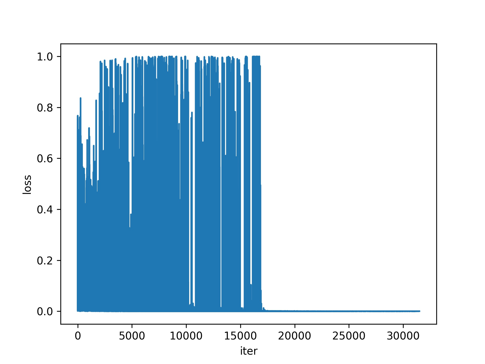 | 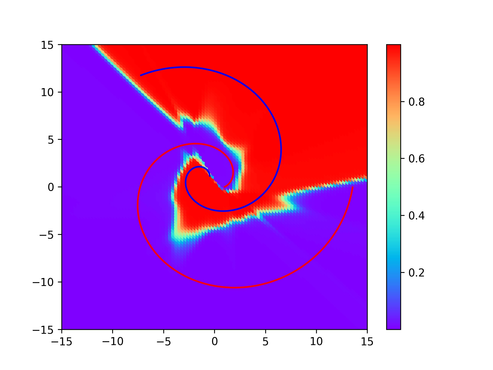 | 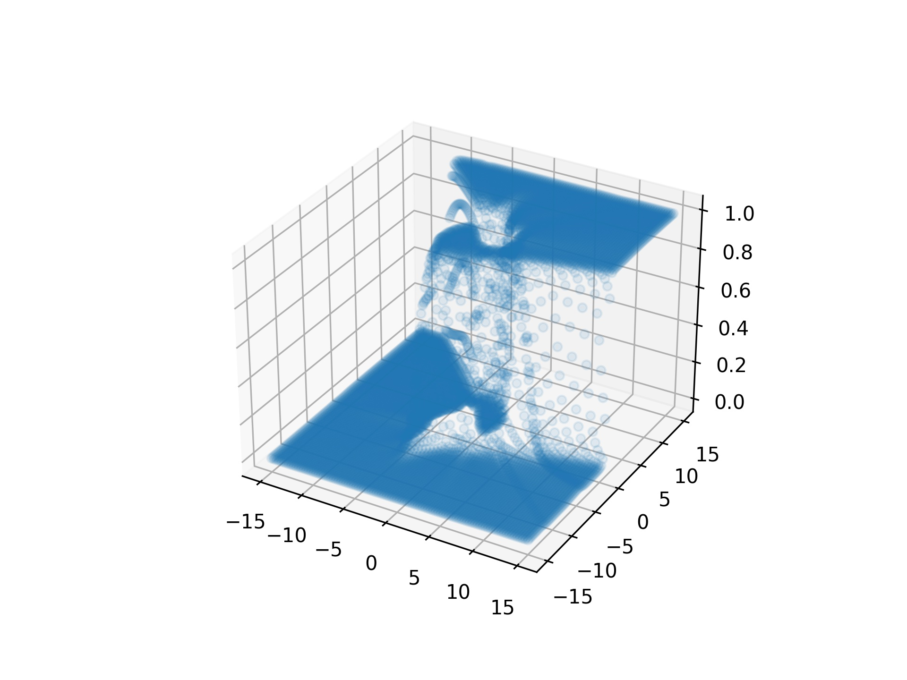 |


## Additional Analysis

Except for the variable values regulated in the experiment, all values(hyper-params) are set to be the same.

### Learning Rate

| lr = 1 (base)                                                | lr = 0.1             | lr = 0.01             |
| ------------------------------------------------------------ | -------------------- | --------------------- |
|  | 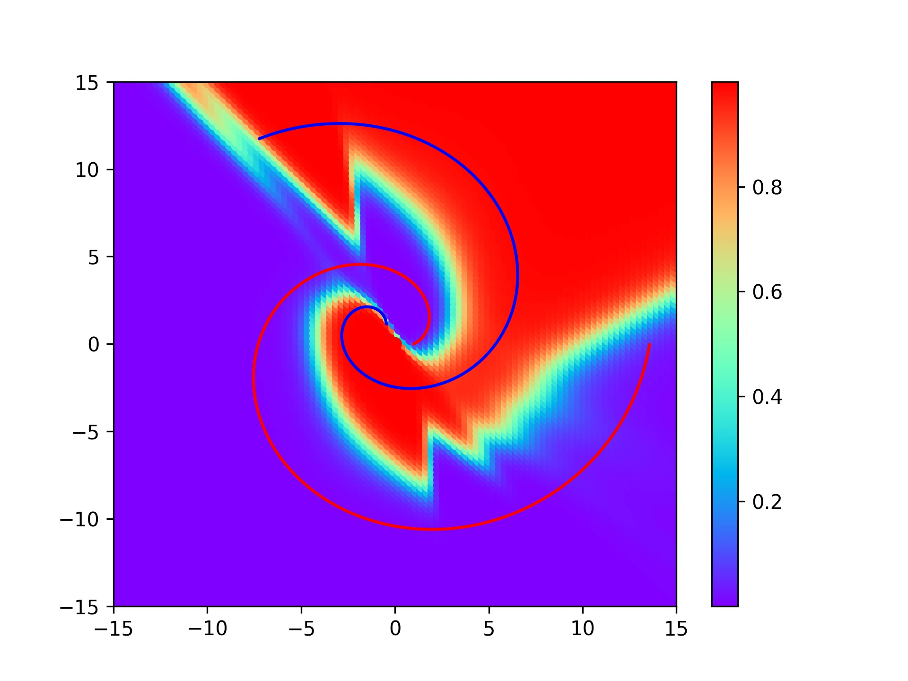 | 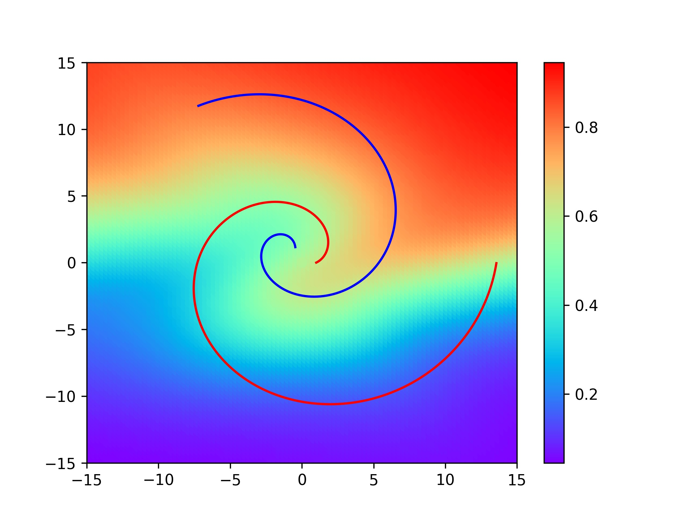 |

It appears to have found the appropriate learning rate value.

### Epochs

| Epochs = 50 (base)     | Epochs = 30            | Epochs = 10            |
| ---------------------- | ---------------------- | ---------------------- |
|  | 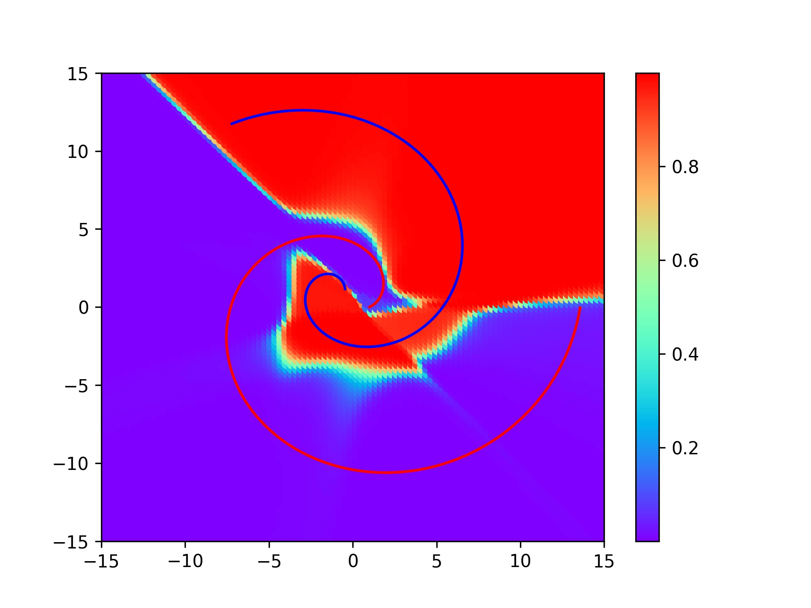 | 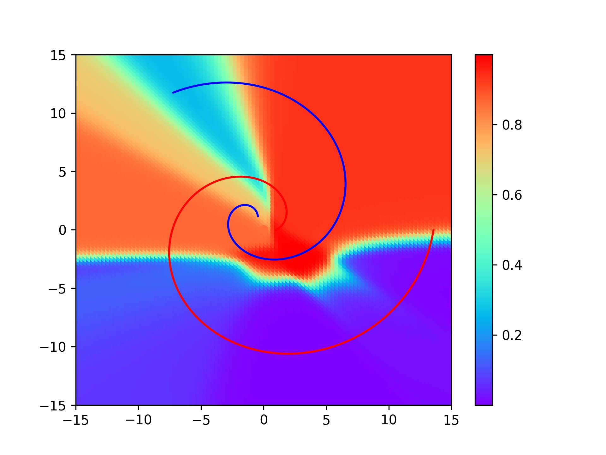 |

Given the loss plot(loss graph), there has been no significant difference since it dropped sharply from about 10000-20000(iters), indicating that learning has been stable since epochs was about 15–30. Therefore, there is no significant difference between 30 and 50. I think It's okay to stop learning at a location where loss is moderately reduced(about epochs 15-30).

### Number of Neurons (for Hidden Layer)

- `h1`: # of 1st hidden layer's neuron
- `h2`: # of 2nd hidden layer's neuron

| h1 = 100, h2 = 50 (base) | h1 = 10, h2 = 5           | h1 = 5, h2 = 2           |
| ------------------------ | ------------------------- | ------------------------ |
|    | 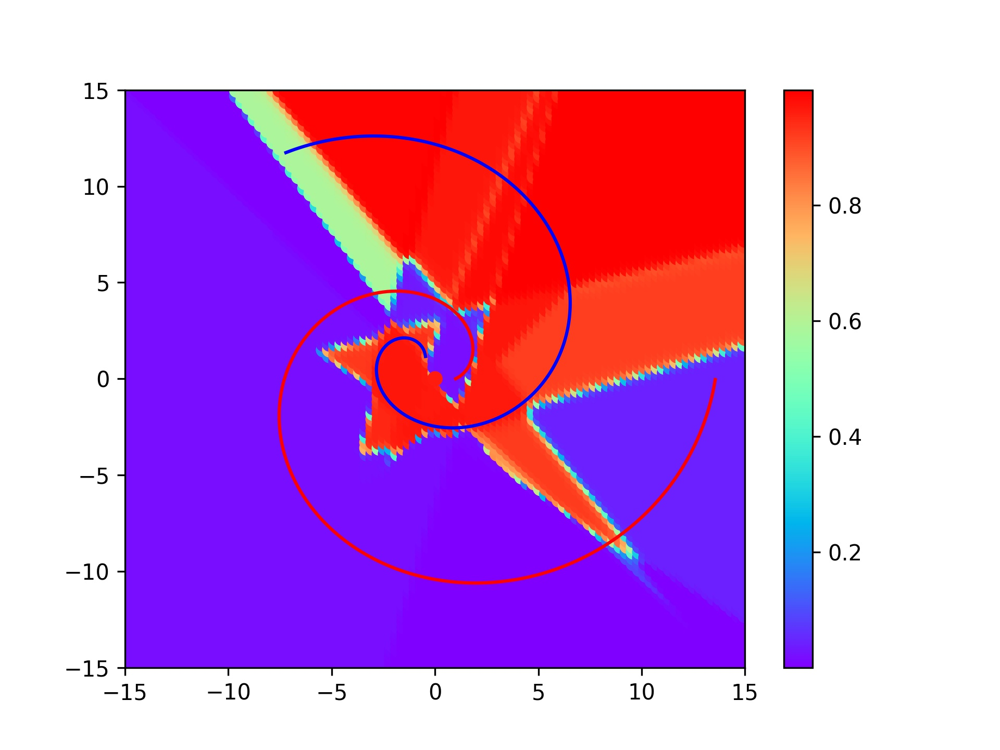 | 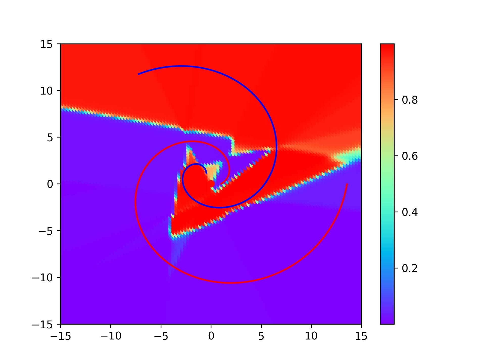 |

It appears to have found the appropriate # of neuron value.
